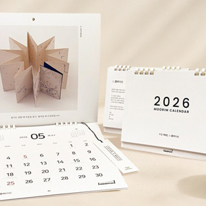

# 개인 프로젝트 (기여도 100%) : Moorim 리디자인
# 제작기간 - 2025.07.24 ~ 
## Moorim 제작 목록
* 메인(index.html) - 다양한 슬라이드 구조와 레이아웃 구성
* 서브(company / product) 
## Moorim 사용 색상
* `#000`
* `#fff`
* `#0069B3` : 청색계열 로고 색상
* `#8CC63F` : 그린계열 로고 색상
* `#404246` : 무채색계열 색상
## Moorim 사용 글꼴
* `'Pretendard',sans-serif;`
## Pretendard 링크
* `<link rel="stylesheet" as="style" crossorigin href="https://cdn.jsdelivr.net/gh/orioncactus/pretendard@v1.3.9/dist/web/static/pretendard-dynamic-subset.min.css" />`
## Moorim 폴더 / 파일 구성
* `./styles/common.css` : header, footer 공통 CSS
* `./styles/reset.css` : 설정 초기화 CSS
* `./scripts/index.js` : index.html에 해당하는 JS (메인 페이지 동적기능)
* `./scripts/common.js`: index.html에 해당하는 JS (공통적인 동적기능)
* `./index.html` : 메인 페이지 HTML 
## font-size  / font-weight (header ~ footer 순서대로 사용한 폰트크기)
1. `18px (1.125em;) - Medium (500)` : gnb 
2. `14px (0.875em;) - Medium (500)` : 언어변경 KOR ~ ENG
3. `20px (1.25em;) - Medium (500)` : 1행 bnr 중간 글자
4. `60px (3.75em;) - Medium (500)` : 1행 bnr 큰 글자
5. `34px (2.125em;) - Medium (500)` : 2행 제목 
6. `18px (1.125em;) - Regular (400)` : 2행 내용
7. `20px (1.25em;) - Medium (500)` : 2행 제품명 글자 (펄프, 종이, 신소재) 
8. `20px (1.25em;) - Regular (400)` : 3행 btn 내용
9. `24px (1.5em;) - Medium (500)` : 4행 (그리드) 내용

## 글자 그림자(box-shadow) 설정
* `(box-shadow: offset-x offset-y blur-radius spread-radius color;)`: 2행 제품명 글자(펄프, 종이, 신소재) / 4행 그리드 내용 
## Moorim line-height 
* `140% (1.4)` 

## 반응형 디자인
* 데스크탑 : 1440-1920
* 태블릿 : 1339-850
* 모바일 : 849-320 

* a태그 이동 링크 막기
`document.querySelectorAll('a').forEach(function(link) {
    link.addEventListener('click', function(e) {
    if (this.getAttribute('href') === '#' || this.getAttribute('href') === '') {
            e.preventDefault();
        }
    });
});`

* 슬라이드
                    
 <!--news 슬라이드 시작-->
                        

                            
                        

                        

                            
                        

                        

                            
                        

                        

                            
                        

                        

                            
                        

                        

                            
                        

                        

                            
                        

                        

                            
                        

                        

                            
                        

                        

                            
                        

                    
